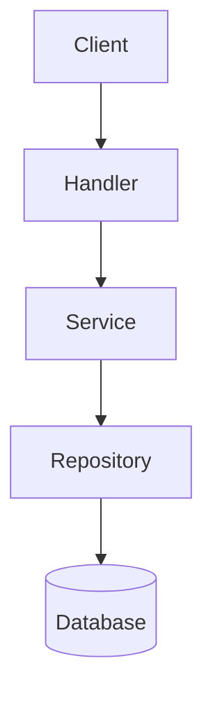

# Documentation Architect Skill

This skill allows the agent to act as a technical writer and architect, ensuring documentation matches reality.

## Capabilities

### 1. Generate README
- **Input**: A directory path (e.g., `inventory-api/`).
- **Action**: Analyze `main.go` / `main.py` and service files to understand the module's responsibility.
- **Output**: A `README.md` containing:
    - Service Description
    - API Endpoints (inferred from Handlers)
    - Environment Variables (inferred from Config)
    - How to Run

### 2. Generate Architecture Diagrams (Mermaid)
- **Action**: Visualize dependencies.
- **Syntax**:

- **Use Case**: When asked "visualize the flow", generate a Mermaid block in the response or artifact.

## Instructions
1. **Read**: Scan the target directory recursively (limit depth to 2).
2. **Synthesize**: Summarize public functions and API routes.
3. **Write**: Create or overwrite `README.md` with the structured content.
